# GitHub Actions Workflow Diagrams

```mermaid
flowchart TD
    %% GitHub Actions Workflow Dependency Diagram

    classDef workflow fill:#e1f5fe,stroke:#01579b,stroke-width:2px
    classDef trigger fill:#fff3e0,stroke:#e65100,stroke-width:2px
    classDef job fill:#f3e5f5,stroke:#4a148c,stroke-width:2px
    classDef dataFlow fill:#e8f5e9,stroke:#1b5e20,stroke-width:2px,stroke-dasharray: 5 5

    subgraph Build_and_Push_Docker_Image["Build and Push Docker Image"]
        direction TB

        Build_and_Push_Docker_Image_trigger["🎯 workflow_run | push"]:::trigger
        Build_and_Push_Docker_Image_build-and-push["📋 build-and-push\n(env: prod)"]:::job
    end

    subgraph Container_Security_Scan["Container Security Scan"]
        direction TB

        Container_Security_Scan_trigger["🎯 workflow_run | push"]:::trigger
        Container_Security_Scan_extract-version["📋 extract-version"]:::job
        Container_Security_Scan_extract-version -.->|version| Container_Security_Scan_extract-version_version['data']:::dataFlow
        Container_Security_Scan_extract-version -.->|image-ref| Container_Security_Scan_extract-version_image_ref['data']:::dataFlow
        Container_Security_Scan_trivy-scan["📋 trivy-scan"]:::job
        Container_Security_Scan_extract-version --> Container_Security_Scan_trivy-scan
        Container_Security_Scan_snyk-scan["📋 snyk-scan\n(env: prod)"]:::job
        Container_Security_Scan_extract-version --> Container_Security_Scan_snyk-scan
        Container_Security_Scan_dockle-scan["📋 dockle-scan"]:::job
        Container_Security_Scan_extract-version --> Container_Security_Scan_dockle-scan
        Container_Security_Scan_generate-report["📋 generate-report"]:::job
        Container_Security_Scan_extract-version --> Container_Security_Scan_generate-report
        Container_Security_Scan_trivy-scan --> Container_Security_Scan_generate-report
        Container_Security_Scan_snyk-scan --> Container_Security_Scan_generate-report
        Container_Security_Scan_dockle-scan --> Container_Security_Scan_generate-report
    end

    subgraph Detect_Release_from_CHANGELOG["Detect Release from CHANGELOG"]
        direction TB

        Detect_Release_from_CHANGELOG_trigger["🎯 push"]:::trigger
        Detect_Release_from_CHANGELOG_detect-and-release["📋 detect-and-release\n(env: prod)"]:::job
    end

    subgraph Simple_Build_Docker["Simple Build Docker"]
        direction TB

        Simple_Build_Docker_trigger["🎯 workflow_dispatch"]:::trigger
        Simple_Build_Docker_release["📋 release\n(env: prod)"]:::job
    end

    Detect_Release_from_CHANGELOG_trigger ==> |triggers| Build_and_Push_Docker_Image_trigger
    Build_and_Push_Docker_Image_trigger ==> |triggers| Container_Security_Scan_trigger
    Push["📝 git push"]:::trigger
    TagPush["🏷️ git tag"]:::trigger
    Manual["⚡ Manual"]:::trigger

    TagPush --> Build_and_Push_Docker_Image_trigger
    TagPush --> Container_Security_Scan_trigger
    Manual --> Container_Security_Scan_trigger
    Push --> Detect_Release_from_CHANGELOG_trigger
    Manual --> Simple_Build_Docker_trigger
```

## Usage

Copy the Mermaid code above and paste it into:
- [Mermaid Live Editor](https://mermaid.live)
- [GitHub Markdown](https://github.com/) (supports Mermaid)
- [Notion](https://notion.so/) (with Mermaid block)
